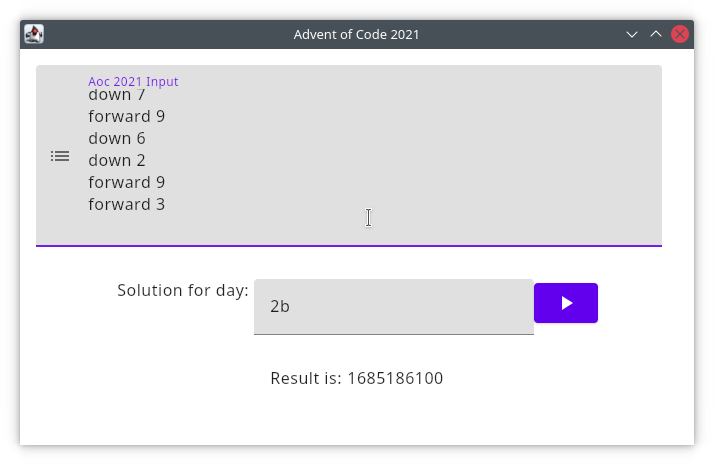

# Advent of Code 2021

This repository is hosted at `https://gitlab.com/draget-advent-of-code/aoc2021` and only mirrored to GitHub.

Draget's (Michael G) solutions to Advent of Code 2021. The goal is not only to solve the tasks, but add a little something each time to grow my skills in different areas.

All new aspects are documented in the [changes](#changelog) section below.

## Technology

This project is based on [Kotlin](https://kotlinlang.org/) and features a [Desktop Compose MPP](https://www.jetbrains.com/lp/compose-mpp/) based GUI that will also improve over time and get more features. Currently, it allows you to paste the input, select the day and sub-task (e.g. `1a` or `3b`) and calculate the solution.

*The GUI still needs a lot of work ;-)*

## Building and running

* Build: `./gradlew build`
* Test: `./gradlew verify`
* Run: `./gradlew run`

## Contributing

Even if I want to learn myself, I still very much appreciate if you want to make suggestions or tell me how I can do something better, by raising an issue or suggesting a change in a MR. While I doubt anyone would do that for a AoC repository, input is still welcome!

## Changelog

### 2021-12-12
* Solve Day 5
* Solve Day 6
* Solve Day 7

### 2021-12-11
* Fix application manifest (Now runs with `./gradew run`)
* Add CI with coverage display in MRs using Jacoco.
* Solve Day 4

### 2021-12-07
* Solve Day 3
* Add a README
* Add GitLab Pipeline status and Coverage banner.

### 2021-12-06
* Solved Day 2
* Show proper error message if no implementation to solve the task can be found.

### 2021-12-05
* Solved Day 1
* First Desktop Compose GUI (with a very rough design)

### 2021-12-03
* Initial project setup
